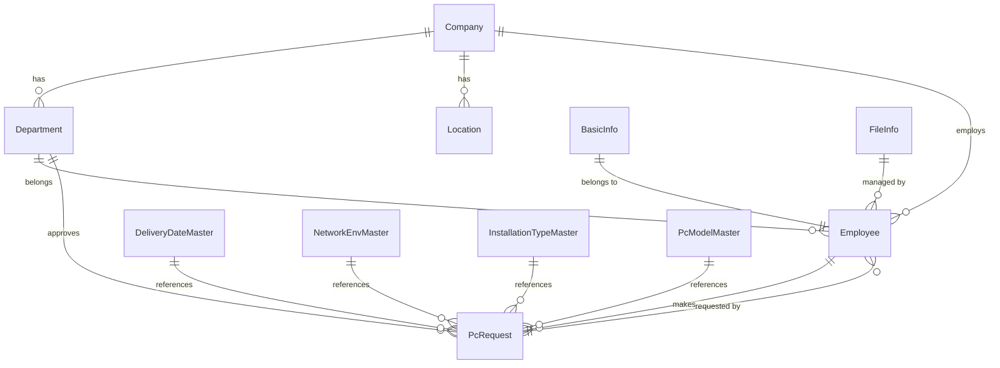

# 概念データモデル

## エンティティと関係性

## エンティティの説明

### Company（企業）
企業そのものを表す概念です。組織としての基本的な単位となります。

### Department（部門）
企業内の組織区分を表す概念です。企業活動における機能的な単位となります。

### Employee（社員）
企業に所属する人員を表す概念です。企業活動を実際に行う主体となります。

### Location（拠点）
企業が活動を行う物理的な場所を表す概念です。

### BasicInfo（基本情報）
社員の基本的な情報を管理する概念です。個人情報や雇用情報などの基礎的なデータを保持します。

### FileInfo（ファイル情報）
システム内で管理されるファイルのパス情報や関連メタデータを保持する概念です。

### PcRequest（PC申請）
社員のPC関連の申請情報を管理する概念です。申請状況、承認状態、機器情報などを含みます。

### DeliveryDateMaster（希望納品日マスタ）
PC申請における標準的な納品日の選択肢を管理する概念です。納品可能日や納期の基準値を定義します。

### NetworkEnvMaster（ネットワーク利用環境マスタ）
利用可能なネットワーク環境の種類や設定を管理する概念です。社内LAN、VPN、リモートアクセスなどの環境定義を含みます。

### InstallationTypeMaster（導入区分マスタ）
PCの導入形態や目的を分類する概念です。新規導入、更新、増設などの区分を定義します。

### PcModelMaster（選択機種マスタ）
申請可能なPCモデルの一覧を管理する概念です。メーカー、スペック、用途などの情報を含みます。

## 関係性の説明

1. 企業と部門
   - 企業は複数の部門を持つことができます
   - 部門は必ず1つの企業に属します

2. 企業と拠点
   - 企業は複数の拠点を持つことができます
   - 拠点は必ず1つの企業に属します

3. 企業と社員
   - 企業は複数の社員を雇用することができます
   - 社員は必ず1つの企業に所属します

4. 部門と社員
   - 部門には複数の社員が所属することができます
   - 社員は必ず1つの部門に所属します

5. 基本情報と社員
   - 基本情報は必ず1人の社員に紐づきます
   - 社員は1つの基本情報を持ちます

6. ファイル情報と社員
   - ファイル情報は特定の社員によって管理されます
   - 社員は複数のファイル情報を管理することができます

7. PC申請と社員
   - PC申請は必ず1人の社員によって作成されます
   - 社員は複数のPC申請を作成することができます
   - PC申請は部門による承認プロセスを経ます

8. PC申請とマスタ情報
   - PC申請は希望納品日マスタから納品日を選択します
   - PC申請はネットワーク利用環境マスタから利用環境を選択します
   - PC申請は導入区分マスタから導入形態を選択します
   - PC申請は選択機種マスタからPCモデルを選択します
   - 各マスタは複数のPC申請から参照されます 